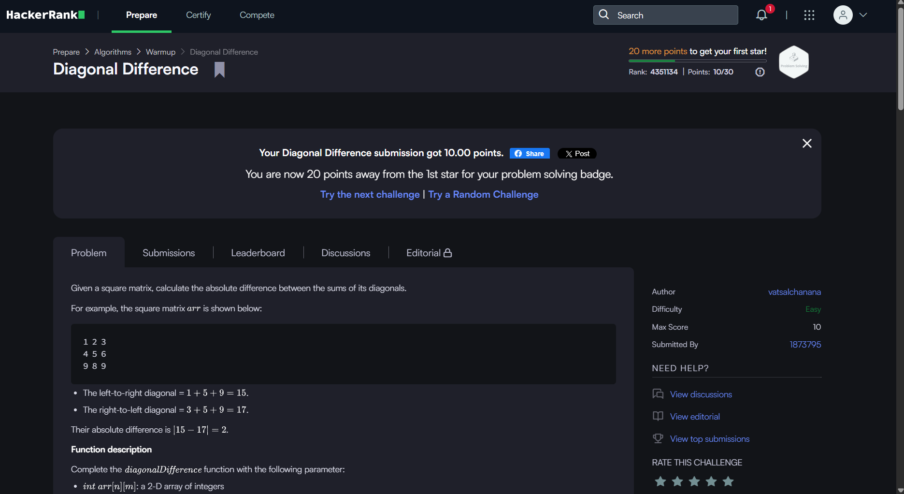
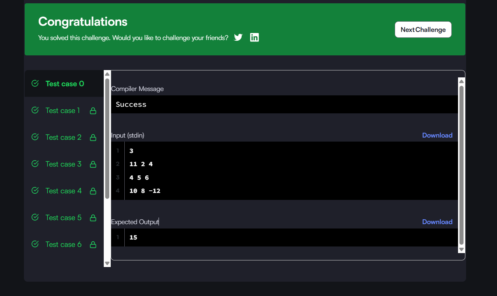
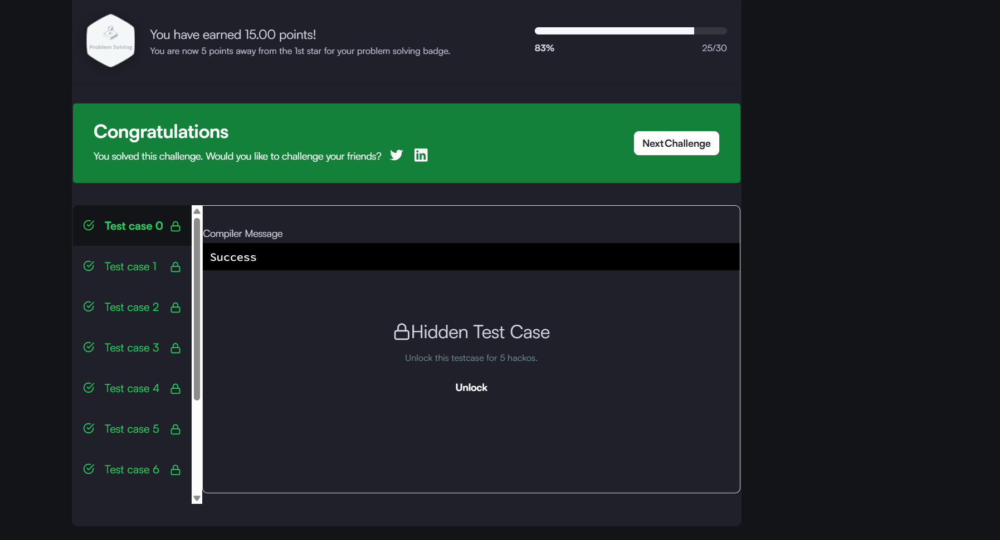
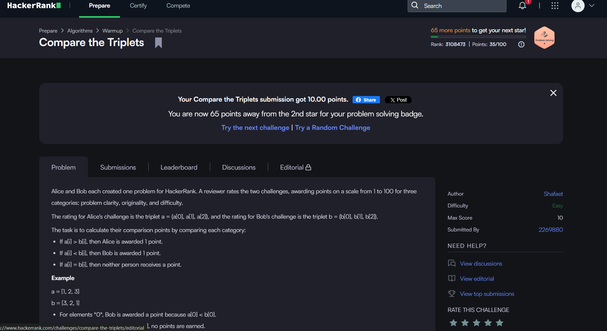
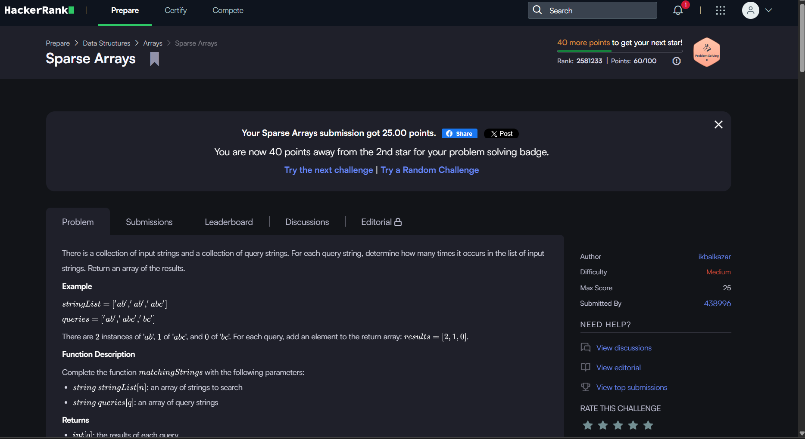
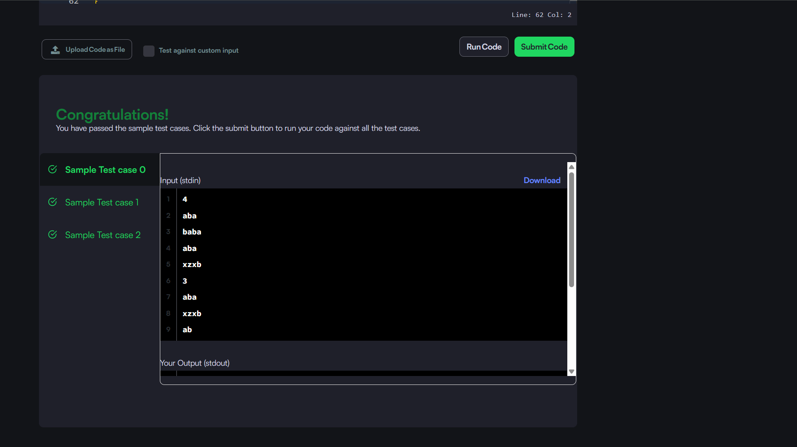

# HackerRank 3rd Semester Portfolio

Personal HackerRank practice log — part of B25CS0311 portfolio

**Name:** Vijaykumar
**Roll No:** R25EJ176

**HackerRank Profile:** [https://www.hackerrank.com/profile/vijaymuttangi045]

## Problems Solved
- [Diagonal Difference](./diagonal-difference)
- [Dynamic Array](./dynamic-array)
- [Time Conversion](./time-conversion)
- [Compare the Triplets](./compare-triplets)
- [Sparse Arrays](./sparse-arrays)

## Complexity Summary

| Problem | Time Complexity | Space Complexity |
|---|---|---|
| Diagonal Difference | O(N) | O(1) |
| Dynamic Array | O(N + Q) | O(N) |
| Time Conversion | O(1) | O(1) |
| Compare the Triplets | O(1) | O(1) |
| Sparse Arrays | O(N + Q) | O(N) |

## Screenshots

### 1. Diagonal Difference

### 2. Dynamic Array

### 3. Time Conversion

### 4. Compare the Triplets

### 5. Sparse Arrays

## Badges
